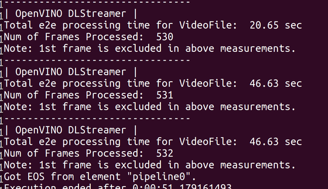
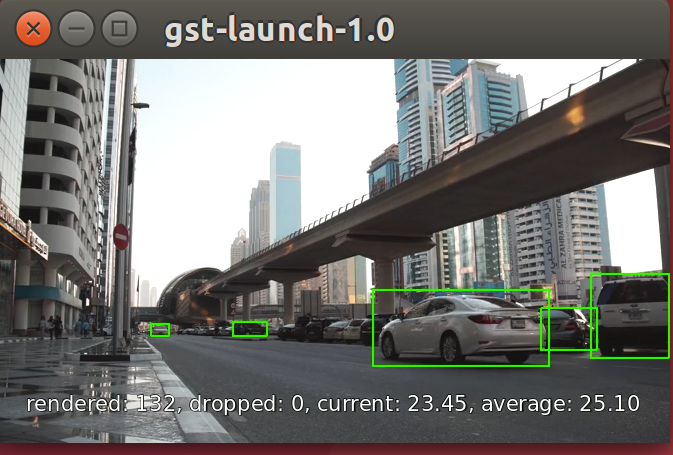
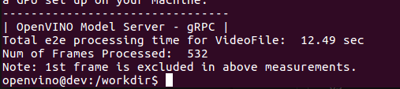
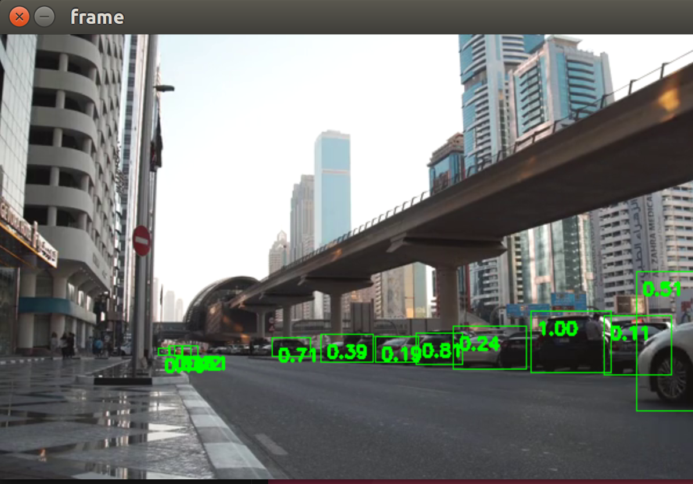

# Remote Robotics
OpenVINO Toolkit provides two utilities for quick AI Deployment:
1. **OpenVINO Model Server:** gRPC based Model Serving Container (similar to TFServing)
2. **OpenVINO DL Streamer:** gstreamer based pipeline elements (infer, convert, publish2mqtt) 

## Pre-req for comparison
- single FP16-INT8 pre-trained model that is already available in both approaches.
- same video file with resolution already in target model input size to ensure the data transmitted is similar (e.g. grpc resize on client, vs dlstreamer resized on server)
- ensure clients'/server all are using localhost


## Approach for comparison
```
/**** modelserver flow *****/

// grpc-client.py
while(!EOF)
    readFrame
    transformFrame
    network.exec ---_--img------>
                 <--resultdata--- ModelServerInference
    print currtime


/**** dlStreamer flow ****/

// streamfrmvideo.sh Generate rtp stream from video file via gstreamer

-------rtp-h264/5-stream------> gst decodeFrame
                                gst transformFrame
                                gst inference
                                gst convertresultdata
                                print currtime


/**** Compare *****/

currTimeLast - currTimeFirst = ~totalTimeToProcessVideo (skip-1st-frame)
number of print times = number of frames processed

Outcome: X time taken e2e to process N frames (excluding overheads)
```

### Setup
```
docker pull openvino/model_server:latest
docker pull openvino/ubuntu18_data_dev:latest

// download vehicle-detection-adas-0002 IR model if not present in repo already.
```

## Run Tests

### Run grpc - OpenVINO Model Server
```
// server container
docker run --network host -d --rm -v $(pwd)/intel:/opt/ml/models/ -p 9000:9000 -p 9001:9001 openvino/model_server:latest --model_path "/opt/ml/models/vehicle-detection-adas-0002" --model_name "vehicle" --port 9000 --rest_port 9001 --log_level ERROR

// client container
docker run --network host -it --rm -v $(pwd):/workdir -v ~/.Xauthority:/root/.Xauthority -v /tmp/.X11-unix/:/tmp/.X11-unix/ -e DISPLAY=$DISPLAY openvino/ubuntu18_data_dev:latest

cd /workdir/

python3 -m pip install -r grpc-client-requirements.txt
python3 grpc-client.py
```

### Run DLStreamer
```
// run DL Streamer
docker run --network host -it --rm -v $(pwd):/workdir -v ~/.Xauthority:/root/.Xauthority -v /tmp/.X11-unix/:/tmp/.X11-unix/ -e DISPLAY=$DISPLAY openvino/ubuntu18_data_dev:latest

// python result of gstreamer inference
gst-launch-1.0 filesrc location=test.sdp ! sdpdemux timeout=0 ! \
decodebin ! \
gvainference model=intel/vehicle-detection-adas-0002/1/vehicle-detection-adas-0002.xml device=CPU ! queue ! \
gvapython module=dlstreamer-result-sender.py ! \
fakesink sync=false

// Start streaming basic (non-optimal)
ffmpeg \
    -re \
    -i test.mp4 \
    -an \
    -c:v copy \
    -f rtp \
    -sdp_file test.sdp \
    "rtp://127.0.0.1:5000"
```
## Results

- ### Input Clip
    - h264 encoded, 672x384 (target FP16-INT8 model input size)
    - 25fps, length: 21sec
- ### DLStreamer (FFMPEG + GSTREAMER + OPENVINO - 1 way)



- ### ModelServer (OPENCV + GRPC - 2 way)
    - 0.02sec gRPC predict time per frame


